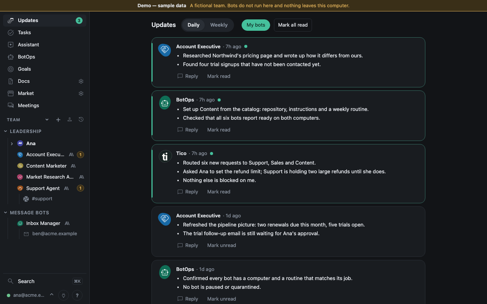

# Tico

Tico is an open-source operating system for a company's human and AI team (Apache-2.0). People file
work, answer bots and approve actions in a web app; AI employee bots pick the work up, run it with
the company's own model subscriptions, and report back. It is built for companies from a handful of bots up.
A small pilot is what has been measured ([sizing](docs/sizing.md)).

- **A small server holds the company.** One Docker install (the server, HTTPS through Caddy or a
  Cloudflare Tunnel, Litestream backups, an optional updater) keeps tasks, chats, approvals,
  schedules, files and people in SQLite. The server never runs a bot or a model CLI; when decisions (or Slack routing) are on, it sends the text of each
  question to the decision provider you configured (TypeSafe, or OpenAI, Anthropic, Gemini, xAI or OpenRouter with a key stored on the server).
- **Computers run the bots.** A Mac (the native runner) or any Linux or cloud machine (the
  `tico-runner` image) joins with a one-time code, claims work over HTTPS, and runs each bot's turn
  in that bot's own git repository. Model logins and bot credentials stay on the computer.
- **Harnesses are installed per computer, on demand.** Codex, Claude Code, Gemini CLI, Grok, or a
  multi-provider catch-all; each bot picks one. People sign in with built-in Google or Microsoft
  sign-in, and GitHub access comes from a per-company GitHub App scoped to each bot's own repository.

## Quick start

On a Linux server (about 2 GB, with a domain pointed at it), run the installer of the release you want:

```bash
curl -fsSL https://github.com/ticoteam/tico/releases/download/vX.Y.Z/install.sh | sh
```

It installs Docker if needed, downloads that release's compose bundle (checksum verified) and walks you through `tico setup`:
a domain name to a signed-in Tico, with each step checked. Then open the app, finish the first-run wizard, and use
**Settings > Devices > Add computer** to join a Mac or a Linux box. What you need first, where to get a server, and what
you will see are in [docs/install.md](docs/install.md).

Just looking? `docker run --rm -p 127.0.0.1:8765:8765 ghcr.io/ticoteam/tico:latest demo` opens a fictional
company on localhost with no setup ([docs/demo.md](docs/demo.md)).



## Documentation

| Read | For |
|---|---|
| [docs/install.md](docs/install.md) | Installing the server, adding computers, updates and backups |
| [docs/architecture.md](docs/architecture.md) | What runs where, how a bot turn flows, why the server runs no bots or model CLIs |
| [docs/sizing.md](docs/sizing.md) | Server and computer sizes; what was measured and what is a guess |
| [SECURITY.md](SECURITY.md) | Reporting a vulnerability and the threat model |
| [docs/harnesses.md](docs/harnesses.md) | Installing and choosing model harnesses per computer |
| [docs/github-app.md](docs/github-app.md) | The per-company GitHub App and token scoping |
| [docs/people.md](docs/people.md) | People, roles and sign-in roster |
| [docs/databases.md](docs/databases.md) | Letting bots read the company's own databases (PostgreSQL, MySQL, SQLite) read-only, and keeping your config private |
| [docs/meetings.md](docs/meetings.md) | Meetings and call transcripts |
| [docs/creating-bots.md](docs/creating-bots.md), [docs/onboarding.md](docs/onboarding.md) | Creating bots and the first-run flow |
| [docs/environments.md](docs/environments.md) | Sign-in options, environments, profiles, removal |
| [docs/files.md](docs/files.md) | What bots publish, versions, who can see a file |
| [docs/docs.md](docs/docs.md) | Docs: internal docs with history and locks, linked docs, import, search |
| [docs/updates.md](docs/updates.md) | Updating the server and its computers |
| [docs/assistant.md](docs/assistant.md) | The built-in Assistant: what it does at once and what it proposes |
| [docs/librarian.md](docs/librarian.md) | The built-in Librarian: answers from the company's docs, with citations |

## Hosting modes

| Mode | Where the server runs | Status |
|---|---|---|
| Docker | Any Linux server, HTTPS by Caddy or Cloudflare Tunnel, built-in Google or Microsoft sign-in | the one-line installer; [docs/install.md](docs/install.md) |
| Local only | The same Mac as the runner, bound to `127.0.0.1` | For trying Tico out; `scripts/tico env create --local` (below) |

The server never invokes a model, and a runner never holds company-wide authority: it works one
leased attempt at a time. A bot is one git repository plus one row on the server. One environment
is one company; several can run side by side on one Mac.

## Local-only trial on one Mac

This runs the server and the runner on the same Mac, for evaluation or development. For a real
company, install the server with Docker and add the Mac as a computer.

Prerequisites: macOS 13 or later, `python3.12` on `PATH`, `git`, and `node` with `npm`. A model CLI
you already have on `PATH` is used as it is; the runner installs the ones it is missing for the providers
you enable, and keeps them current ([docs/harnesses.md](docs/harnesses.md)). Tico assumes no vendor: you choose
the providers you use (`openai` with `codex`, `anthropic` with `claude`, `google` with `gemini`, `xai` with
`grok`, `cursor` with `cursor-agent`, and `deepseek`, `moonshot`, `meta`, `mistral` or `openrouter` with `pi`) when you create the
environment, and can change them later in Settings. Sign a CLI in from Settings > Devices or its own terminal login.
Rust and the Tauri CLI (`cargo install tauri-cli`) are needed only for the desktop app.

1. **Clone this repository and create the Python environment the scripts expect.** Everything below
   runs from the checkout root. `scripts/setup-runner.sh` builds exactly this venv; these are the
   manual equivalents, and `scripts/tico` finds the interpreter on its own.

   ```bash
   git clone https://github.com/ticoteam/tico && cd tico
   python3.12 -m venv runtime/runner-venv
   runtime/runner-venv/bin/python -m pip install -r backend/requirements.txt
   ```

2. **Create the environment.** This writes `~/.config/tico/environments/acme/`, picks a free
   loopback port, mints the owner token, copies in the seed roster with your names substituted, and
   seeds the database. The id it prints is permanent; the names are not.

   ```bash
   scripts/tico env create acme --company Acme --app Atlas --assistant Morgan \
     --local --owner-email you@example.com --owner-name "Your Name" \
     --providers anthropic,openai --default-model claude-opus-5
   ```

   `--providers` is required (a non-interactive create without it fails and lists the choices);
   `--default-runtime` and `--default-model` pick what bots without their own model run on, and
   default to the first provider's recommended model. The choice is seeded into the server
   (`TICO_ENABLED_PROVIDERS`, `TICO_DEFAULT_RUNTIME`, `TICO_DEFAULT_MODEL`) on first boot, after
   which the database holds it and **Settings > AI providers** edits it. A Docker install seeds it
   the same way from the server's `.env` (`TICO_ENABLED_PROVIDERS=...`). A bot
   resolves its runtime and model from its own setting, then the company default, then the first
   enabled provider's recommended model; with none of those it refuses to start and says so.

3. **Install and start the server.** The launchd job reads the environment's own `server.env`, so a
   hand-run `uvicorn` and the service see identical configuration.

   ```bash
   scripts/tico -e acme server install
   scripts/tico -e acme server status
   ```

4. **Open the app.** A loopback server has no identity proxy in front of it, so this hands the
   owner token to `/api/v2/local-signin` once and the server sets a session cookie. The owner
   lands on the first run wizard; **Finish setup** in the sidebar returns to it at any time.

   ```bash
   scripts/tico -e acme open
   ```

5. **Name things and answer the questions.** A company that has not chosen its AI providers (a
   hosted install, or `env create` run without seeding) first sees "Which AI providers do you
   use?" with a default model. The next two screens set the company, app and
   assistant names, which override what `env create` recorded, then ask what the company does, who
   it sells to, how big the team is, where work arrives, what repeats, and what must never happen
   without a person. Every **Next** saves a draft, and every bot is created with those answers in
   its `knowledge/company.md`.

6. **Pick your bots.** The catalog in `templates/catalog/` is shown as cards: what each bot owns,
   what it will never do, what it runs on, and the `AGENT.md` it would be created with, which you
   can edit before taking it. The assistant and BotOps are required; the answers tick the rest.

7. **Set up this Mac.** **Add computer** downloads a private 15 minute setup file, and the screen
   prints the three commands to run in this checkout. `enroll` creates the workspace (mode 700,
   with `secrets/` inside it), a profile is a directory holding one provider login, and `bot` is
   the job that claims and runs turns.

   ```bash
   scripts/tico -e acme enroll --code-file "$HOME/Downloads/<setup-file>.json" --label "Studio Mac"
   scripts/tico -e acme profile add default && scripts/tico -e acme profile login default <runtime>
   scripts/tico -e acme install bot
   ```

8. **Review and finish.** **Finish setup** creates every chosen bot as `planned` and files one task
   for BotOps per bot it has to build. The progress screen that follows shows each bot, a link to
   its setup task, and an **Activate** button as soon as its repository exists.

9. **The assistant and BotOps.** Every company has both, and neither can be archived. Once the Mac is enrolled and
   running, it materializes those two repositories from the catalog by itself, and finishing setup activates them.
   BotOps then sets up every other bot you chose and finishes each task with the
   one thing to read before activating it. `scripts/tico -e acme doctor` inspects repositories,
   runtime installation and profile sign-in, and makes no model call.

10. **File the first task** in the interface, addressed to any active bot, and watch it run with
    `scripts/tico -e acme logs bot -f`. The bot reports back in the task conversation.

The whole flow, the answer fields and what each step writes are in
[`docs/onboarding.md`](docs/onboarding.md). Offline, `python -m backend.manage enrollment <db>
--operator <person-id> --out <file>` mints the same 15 minute enrollment code that **Add computer**
downloads, and `enroll` reads either file.

## Running two companies on one Mac

`-e <slug>` (or `TICO_ENV`) selects the environment, and everything derived from it stays apart:
the launchd labels and services, the log files, the runner registration and its state directory,
the subscription profiles and their provider logins, the workspace and its `secrets/`, the database
and blob directory of a local server, the seed registry, and the Mac app (its own bundle
identifier, so macOS keeps Dock identity, login state, preferences and notifications apart).

Shared: the git checkout of this repository, the Python environment under `runtime/`, and, in
trusted mode, the macOS user account. Trusted mode prevents collisions and keeps subscriptions
apart, but a bot still runs as you and can read what you can read; it is not a security boundary.
For an unrelated company on the same hardware use isolated mode, one dedicated macOS user per
environment, written out in [`docs/environments.md`](docs/environments.md) along with the full
reference for the environment directory, profiles, backups and removal.

## The desktop app

One Rust crate (`app/`, Tauri 2) builds every environment's app for macOS, Windows and Linux: the
name, icon, identifier and server URL come in at build time, so there is no runtime rename. The
page itself is the hub's, loaded from the server, so the site changes reach the app with no update;
the shell updates itself from the hub's published builds when it changes (`backend/downloads.py`,
`.github/workflows/app.yml`).

```bash
scripts/app.sh build --env acme      # compile into ~/Applications/<App name>.app
scripts/app.sh install --env acme    # build, replace the running copy, open it
scripts/app.sh check                 # compile only, safe while the installed app is running
```

Per environment the build changes the app name and window title, the icon (`icon.png` in the
environment directory, if you put one there), the server URL, and the bundle identifier, which is
derived from the permanent environment id and never typed by hand. For a local server it also
records the path to the owner token file, which the app reads on every launch and trades for a
session cookie, so rotating the token needs no rebuild and the token never enters the bundle.
`scripts/app.sh release` builds the signed macOS bundles and publishes them to the hub; CI does the
same for all three platforms whenever `app/` changes on `main`. Anyone can build from source, in
which case the bundle is ad-hoc signed and Gatekeeper asks for **Open Anyway** the first time.

## Creating bots

A bot is one durable git repository in the environment's workspace plus one row on the server. The
repository holds `AGENT.md`, playbooks, knowledge and memory; the server holds runtime, model,
effort, assignment, tasks and approvals. The runner looks for the checkout at
`<workspace>/emp-<slug>` unless the registration's `repos` map says otherwise.

A new bot starts from the catalog, `templates/catalog/<template>/`: a card saying what the bot is
for, and the repository it is created from. **Settings → Bots → Add from catalog** creates the bot
`planned` and files the same BotOps task the first run wizard does, and BotOps is the one that
materializes the repository, writes the instructions and reports what to read before activating it.
By hand, `scripts/tico -e acme bot create sales --template sales --name "Sales"` materializes a
repository from the same template, and **Settings → Bots** records it. First run is
[`docs/onboarding.md`](docs/onboarding.md). How to write a bot that works, what preflight enforces,
schedules, access and a first week are in
[`docs/creating-bots.md`](docs/creating-bots.md). One rule belongs here: **the bot's repository
link is stored on the bot in Settings**, not in a configuration file. It may be a bare name, an
`owner/name` pair, or an https URL; a bare name is completed by the environment's GitHub owner.
GitHub is optional, and a plain repository in the workspace is enough to run. To give each bot
scoped access to its own repository without sharing a personal token, the owner connects a GitHub App
in Settings: [`docs/github-app.md`](docs/github-app.md).

## Skills in your own Claude Code

The dev bots and people's own Claude Code sessions use the same team skill, from this repo:
`skills/create-pr` (open a draft PR the way the team does). This repo is also a Claude Code plugin
marketplace (`.claude-plugin/marketplace.json`) with one plugin, `tico`, that carries it. Install
it once per computer:

    claude plugin marketplace add ticoteam/tico
    claude plugin install tico@tico

Then `/tico:create-pr` works in any session, and Claude also reaches for it on its own. Bots keep
reading the same file from `$HUB_DIR/skills/`, so there is one copy to change.

## Hosted and self-hosted servers

The server is configured entirely by environment variables, read once in `backend/config.py`. A
named company must also carry a permanent id, or the process refuses to start.

| Variable | Meaning | Example |
|---|---|---|
| `TICO_DB` | SQLite database path. Required; there is no default | `/var/lib/tico/hub.sqlite` |
| `TICO_ENVIRONMENT_ID` | Permanent opaque id for this company. Required whenever `TICO_COMPANY_NAME` is set | `9f3c1ab27d0e4a51` |
| `TICO_COMPANY_NAME` | Company name in the interface | `Acme` |
| `TICO_APP_NAME` | App, window and notification name | `Atlas` |
| `TICO_ASSISTANT_NAME` | The main assistant's conversational name | `Morgan` |
| `TICO_ASSISTANT_BOT` | Slug of that assistant in the roster | `coo` |
| `TICO_OWNER_EMAIL` | Who owns the environment on first boot. Falls back to `owner:` in `hub-access.yaml`; after that the owner is stored and changed in Settings > People ([docs/people.md](docs/people.md)) | `you@example.com` |
| `TICO_PUBLIC_URL` | Where browsers reach this server | `https://atlas.example.com` |
| `TICO_RUNNER_URL` | Where runners enroll, when it differs. A runner on the same machine may use `http://127.0.0.1:<port>` | `https://runner.example.com` |
| `TICO_REGISTRY_DIR` | Seed roster and access list directory; its `integrations/` folder layers the company's own integration pages and query catalogs over the release ([docs/databases.md](docs/databases.md)) | `/etc/tico/registry` |
| `TICO_INTEGRATIONS_DIR` | Where that company layer lives when it is not `<registry>/integrations` | `/etc/tico/integrations` |
| `TICO_BLOB_DIR` or `TICO_BLOB_BUCKET` | Where attachments and meeting files are stored: a directory or an S3 bucket | `/var/lib/tico/blobs` |
| `TICO_ACCESS_ISSUER` and `TICO_ACCESS_AUDIENCE` | Identity proxy issuer and application audience. JWKS is read from `<issuer>/cdn-cgi/access/certs` | `https://acme.cloudflareaccess.com` |
| `TICO_AUTH_PROXY` | `oidc` (built-in sign-in), `cloudflare` or `aws-alb`. Defaults to `cloudflare` when `TICO_ACCESS_ISSUER` is set, else none (loopback sign-in). See [Sign-in options](docs/environments.md#sign-in-options) | `oidc` |
| `TICO_OIDC_ISSUER` | For `oidc`: `https://accounts.google.com`, `https://login.microsoftonline.com/<tenant-id>/v2.0`, or any issuer with OpenID discovery | `https://accounts.google.com` |
| `TICO_OIDC_CLIENT_ID` | For `oidc`: the OAuth client id | `1234-abc.apps.googleusercontent.com` |
| `TICO_OIDC_CLIENT_SECRET` or `TICO_OIDC_CLIENT_SECRET_FILE` | For `oidc`: the client secret, or a file holding it | `/etc/tico/oidc-secret` |
| `TICO_OIDC_ALLOWED_DOMAINS` | For `oidc`, optional: comma-separated email domains that may sign in (Google also checks the `hd` claim) | `acme.com` |
| `TICO_SESSION_SECRET` | For `oidc`, optional: at least 32 characters, signs the login round trip. Generated and kept in `tico-session-secret` beside the database (mode 0600) when unset | |
| `TICO_ALB_ARN` and `TICO_ALB_REGION` | For `aws-alb`: the load balancer's ARN (must equal the token's `signer`) and its region | `arn:aws:elasticloadbalancing:us-west-2:123456789012:loadbalancer/app/tico/50dc6c495c0c9188` |
| `TICO_ALB_KEYS_URL` | For `aws-alb`: base URL for the public keys, replacing `https://public-keys.auth.elb.<region>.amazonaws.com`. Meant for tests | `http://127.0.0.1:9000/keys` |
| `TICO_COGNITO_LOGOUT_URL` | For `aws-alb`: where `/api/v2/logout` sends the browser after clearing the ALB session | `https://acme.auth.us-west-2.amazoncognito.com/logout?client_id=...&logout_uri=...` |
| `TICO_LOCAL_OWNER_TOKEN_FILE` | Loopback owner sign-in. Refused unless `TICO_PUBLIC_URL` is loopback | `.../environments/acme/local-owner.token` |
| `TICO_GITHUB_OWNER` | Organization that completes bare bot repository names | `acme-inc` |
| `TICO_CREDENTIAL_ADMINS` | Comma-separated emails allowed to write shared credentials. The owner when empty | `you@example.com` |
| `TICO_PROCESSING_OPERATORS` | People whose machines may run the Close transcript importer and connector publishers | `dana` |
| `TICO_SCHEDULER` | `1` runs the routine scheduler in this process | `1` |
| `TICO_CREDENTIAL_KMS_KEY` | Credential store key | `alias/tico-acme` |
| `TICO_TYPESAFE_SECRET_ARN` or `TYPESAFE_API_KEY` | Optional key for the decisions provider (TypeSafe's Jev) behind `hub_decisions` / `POST /api/v2/judge` and the Slack gateway (`skills/decisions/SKILL.md`, `questions/README.md`); without it the route answers 503. Decisions were called "judge" before 0.2.4: the route, the `judge.call` audit events and `TYPESAFE_*` names are unchanged, and `hub_judge` / `hub judge` remain as aliases | |
| `TICO_UPDATE_CHECK`, `TICO_RELEASES_URL`, `TICO_VERSION`, `TICO_UPDATER_URL`, `TICO_UPDATER_TOKEN` | The "New version" notice and owner-only "Update now"; `TICO_UPDATE_CHECK=off` disables it. See [docs/releasing.md](docs/releasing.md) | |
| `TICO_RELEASE`, `TICO_OBSERVABILITY_*`, `TICO_POSTHOG_*`, `TICO_SENTRY_*` | Optional release id and telemetry. Empty disables all of it | |

Sign-in for a hosted server is either built in (`TICO_AUTH_PROXY=oidc`: Google, Microsoft Entra ID
or any OpenID Connect issuer, so a server, a DNS record and one OAuth client are enough) or an
identity-aware proxy in front of the app (Cloudflare Access, or an AWS ALB with Cognito) that passes
a signed JWT. Either way the server verifies the credential, then matches the email against the
people roster; an account that is not on the roster is refused, so the sign-in policy and
`hub-access.yaml` have to agree. See [Sign-in options](docs/environments.md#sign-in-options).

Docker is the only way to install and run the server. A company with its own AWS load balancer and Cognito can put it in
front of the Docker server ([Sign-in options](docs/environments.md#sign-in-options)). `.env.example` is the shape of the
server's variable file; real hostnames, buckets, ARNs and people live outside this repository.

## Repository map

| Path | What is in it |
|---|---|
| `backend/` | The server: API, authorization, write layer, scheduler, backups, settings admin (FastAPI, SQLite) |
| `runner/` | The local runner: enrollment, readiness, leases, turns, subscription profiles, the connector and Close transcript workers, and one host per model CLI in `runner/hosts/` |
| `clients/` | What bots and operators call: the `hub` CLI, the HTTP client, preflight, routine validation, company documents, and `environments.py` |
| `ui/`, `app/` | The web interface and its browser tests; the Tauri desktop shell (Rust) |
| `setup/` | `tico setup`, the guided Docker install of the server and of Linux runners |
| `infra/` | cloud-init files for a new server or runner (they call `scripts/install.sh`) |
| `connectors/`, `integrations/`, `skills/` | Shared adapters bots use instead of vendor APIs, one page per outside system, and shared runtime skills |
| `policies/` | Rules every bot follows: approvals, access, handoffs, writing |
| `templates/` | `catalog/` is the bot templates onboarding picks from, one folder per template with its card and its starting repository; `employee-repo/` is the generic starting point, `environment-registry/` seeds a new environment with `coo` and `botops` |
| `scripts/` | `tico`, `hub`, `setup-runner.sh`, `app.sh`, `publish-employee.sh` and maintenance commands |
| `docs/` | Documentation: [how it works](docs/how-it-works.md), [using Tico](docs/using-tico.md), [first run](docs/onboarding.md), [creating bots](docs/creating-bots.md), [files](docs/files.md), [environments](docs/environments.md), [Hermes agents](docs/hermes-agents.md); `history/` holds retired designs |

### Where a change belongs

If only one bot should change, change that bot's repository; if every bot or the system should
change, change this repository.

| Change | Location |
|---|---|
| One bot's role, boundaries or standing instructions | `emp-<slug>/AGENT.md` |
| One bot's repeatable method | `emp-<slug>/playbooks/` |
| Domain facts, learnings and decisions for one bot | `emp-<slug>/knowledge/`, `memory/` |
| One bot's schedules, access or send switch | `emp-<slug>/employee.yaml` |
| Roster, hierarchy, status, model, effort, assigned computer, repository link | **Settings** in the app. The registry directory seeds a new database only |
| Rules every bot must follow | `policies/` |
| The server, runner, connectors, interface, or the starting point for future bots | This repository's code |

## Operating commands

`scripts/tico` is the one command on a Mac that runs bots. `scripts/tico help` prints the full usage; the groups are:

```
scripts/tico [-e ENV] install|uninstall|restart|status|doctor|logs|update|open
scripts/tico env create|list|show|remove ...         the companies on this Mac
scripts/tico -e ENV enroll --code-file F --label L   register this Mac for one company
scripts/tico -e ENV profile add|list|login|assign    the subscriptions its bots run on
scripts/tico -e ENV bot create SLUG --name "Display" [--template T]
scripts/tico -e ENV server install|uninstall|start|stop|restart|status|logs
```

`-e ENV` (or `TICO_ENV`) picks a company environment.

`scripts/setup-runner.sh [--env <slug>] <enrollment.json> [workspace]` does the venv, the
enrollment, the bot service and `doctor` in one go from a file downloaded by **Add computer**, and
`scripts/publish-employee.sh --owner <org> --workspace <dir> <slug>...` turns bot folders into
private GitHub repositories.

## Developer notes

CI runs the Python suite and the browser scripts on every push and pull request
(`.github/workflows/ci.yml`); run both locally before you open one. The suite is kept to the
tests that protect what matters most: the hub's write rules and identity, tasks, approvals, the
batch and MCP, the runner's claim and lease, deploy, release and backup, and outbound-send safety.

```bash
pip install -r backend/requirements-dev.txt
python -m pytest -q -n auto
```

Browser checks need `npm ci` and a Playwright browser (`npx playwright install chromium`), then
`npm run test:ui` (the scripts in `ui/tests/`). The UI has no build step and no runtime network
dependency: `marked` and the icon font are vendored in `ui/vendor/` with their licenses.

The live checkout on an operator's Mac is what the runner executes: the launchd jobs run
`python -m runner` with that directory as the working directory, so an edit in the tree is live for
the next turn, and a pull without a restart leaves the old code running (`scripts/tico status` says
so explicitly). Do development in a git worktree, never in the live checkout, and use
`scripts/tico update`, which pulls and restarts after waiting for turns in flight.

## Contributing

Engineering work is tracked as GitHub issues on [ticoteam/tico](https://github.com/ticoteam/tico/issues);
`skills/tico-tickets/SKILL.md` describes how tickets are filed and worked. To contribute: state the
current behavior, the wanted outcome and how it will be checked; make the smallest durable change;
run the tests above; open a pull request against `main`. Bot repositories are read from the
checkouts on the Mac that runs them, so a push to one is not live until that checkout has it.
Never put a credential in git, in a task, or in bot instructions, and keep company names, people
and accounts out of the repository: examples use the fictional company Acme (`acme.example`).

## Your own deployment

A company that runs Tico keeps its people, bots, policies and connected accounts in its own
registry directory (`TICO_REGISTRY_DIR`) and in bot repositories outside this one; this repository
is the product. `templates/environment-registry/` shows the shape of the registry.
