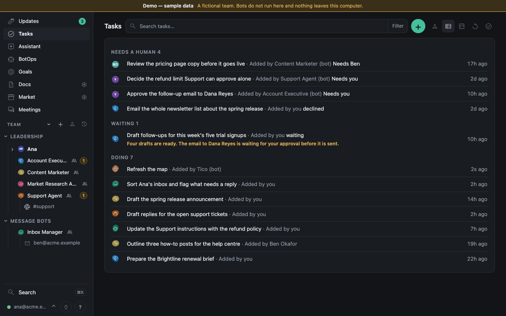
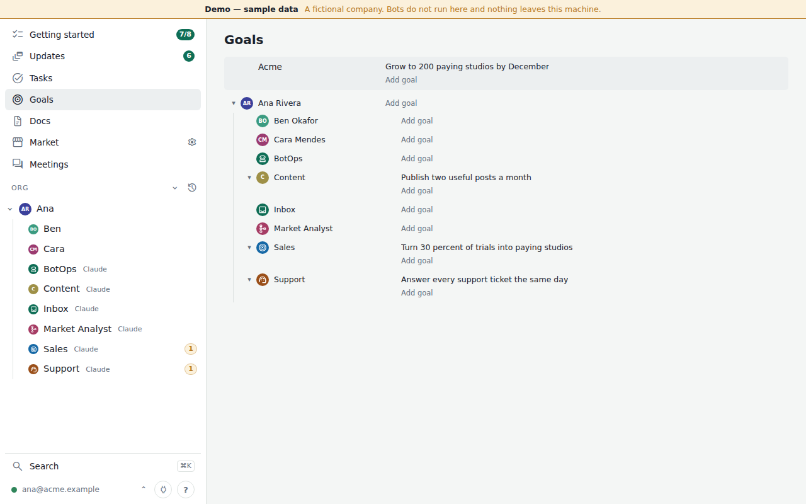

# Using Tico

Short answers to common questions. Sign in at your team's Tico address with the email on its Humans roster. Ask your owner for the address.
How the pieces fit is in [How Tico works](how-it-works.md). Words are defined in the [Glossary](glossary.md); [Navigation](navigation.md) lists the current controls.


Every picture in these docs is a screenshot of [demo mode](demo.md), which you can run yourself.

**How do I give work to a bot or a human?**
On **Tasks**, press **New task** and pick who it is for — any human or bot. On a human's profile,
**Give a task**. On a bot, ask it in Chat. Or ask your own external agent (Grok, Muse, Claude and others) to file
it through Tico's MCP. Each task shows who added it: you, another human, or a bot.

**Where are the built-in bots?**
**Assistant** and **BotOps** are in the main left rail. The Goal Manager is at the top of **Goals**: its routines, its last
run and a box to ask it to change a goal. **Docs** and **Market** have **Ask the Librarian** on the right (a button on a
phone). All four are managed in **Settings > Bots**; they stay out of the team chart and the goal owner list.

**How do I ask a bot a question?**
Open the bot's page and use its **Chat** tab; the reply comes back into the same conversation.
For anything across the team, ask your own external agent: **Connect an external agent** (the plug button beside
your email) gives it a token and Tico's MCP ([Connect an external agent](connect-an-agent.md)).

**How do I know my bot ran?**
The conversation goes *Saved — queued* → *Starting* → *Working* → the reply. When the bot marks
a task done, the task shows under **Tasks → Done** with the bot's note.
Every run is under your email → **Runs**, and on the bot's **More** tab with its files and routines.

**What does *waiting* mean, and the other states?**
*Waiting*: the bot is parked on something — a bot, a child task, or an answer from you.
*Doing*: being worked on (*Doing · starting* until a computer picks it up). *Needs you*, or *Needs <Name>* for someone else: a
human must act — a question, an approval, a blocked or declined item. The all-owners list groups these as **Needs a human**.
A comment on a task answers that task's question, so the bot can ask its next question; it does not answer a different
task in the same room. *Done*: finished, awaiting close.

**Marked a task Done by mistake?**
Choose **Undo** in the toast, or open the finished task under **Done** and choose **Reopen**.
A task you requested for yourself closes when you mark it Done; Reopen works for it too.
The earlier completion stays in its history, while Goals and KPIs count it as active again.

A bot's final answer to a reply appears under that update automatically. An acknowledgement such as
"Thanks" needs only a short answer; it does not need a new task. `hub_update_reply` is for humans.

**My Mac is asleep. What happens?**
Your team's Tico server keeps running: everything is saved and other humans' bots keep answering. Bots on your
Mac show *offline* and new requests show *Saved — waiting for <your Mac>*; they run when it wakes.
A run cut off mid-way is settled by Tico when that is safe (its task was already done, or it
had not used any tool yet) and otherwise opens in front of you as *needs you* the next time you
look at the app, with *Review now* on it. Nothing is silently re-sent. Your Mac being offline for
a few minutes is not something you are asked about; after ten minutes it is.



**What needs my approval, and why?**
Bots carry out authorized work with their granted Tools. Spending, publishing, record changes,
bot or repository deletion, adding outside humans and updating Tico have no blanket Confirm step.
Messages to outsiders stay drafts until the bot's owner turns on its outbound send switch.
A bot may request an optional approval when an action is uncertain; its exact action appears in
**Needs you** with **Approve** / **Decline**. Repository review rules still apply.
Full rules: [Permissions](permissions.md) and [approval policy](../policies/approvals.md).



**How do I rearrange the team chart?**
Drag a human or a bot in the sidebar onto the human or bot it should report to. The owner can
move anyone; everyone else can move what reports up to them, under themselves or their own
reports. The same rule decides whose profile, goals, bot settings and routines you may edit:
your own, and anyone's below you.

**How do I add a routine?**
**Settings → Routines → New routine** (or the Routines card on the bot's page): pick the bot, a
title, a cron (five fields, America/Los_Angeles by default) or a Tico event, and the text the bot
is told each time. A bot can set up its own with `hub routine set`. Details: `docs/routines.md`.

**How do I change what a bot does?**
Open **Bot → More → Instructions → Edit Instructions**, describe the change, and choose
**Ask BotOps to change**. BotOps updates the Instructions, commits and pushes the result; the
bot reads it at its next run once its computer's checkout has the update. An older app may show
the Instructions card under **Docs**. See [Creating bots](creating-bots.md#edit-instructions).

For a manual edit, change `AGENT.md` in `bot-<slug>` (playbooks and `knowledge/` for methods and
facts), commit and push. The runner pulls before the next run; if you maintain its checkout by
hand, pull the update there too. Model, effort, computer, owners and status are changed in
**Settings → Bots**. One-off requests are tasks, not edits.

## Leave work for the next run

A **Note** gives a bot context without starting a run. A **Task** filed with `--next-run`
(alias `--quiet`) is work to do, with an owner, status, result and history; creating it does not
wake the bot. Use your [personal token or external agent](connect-an-agent.md) for the CLI:

```bash
hub note create content "Use the revised tone guide for the next draft."
hub note list --to content --waiting
hub note delete <note-id>
hub task create --owner content --title "Draft the weekly post" \
  --body "Use the notes attached to this task." --next-run
```

`--text-file notes.txt` can replace the note text; `--body-file request.txt` can replace a task's
body. Notes are only for other bots, never a human or the sender itself. You need Write access to
leave one, and the normal task/contact permissions apply to deferred work. Never put a secret in either.

The next run started by chat, a Routine or another task carries waiting notes and deferred tasks.
For a Note, the API reports `waiting`, `carried` and `cancelled_at`. `carried` means a run received
it, not that the bot completed work. A failed run makes it waiting again. A sender or a human who
can see it can cancel a waiting note; once a live or completed run carries it, it cannot be taken
back. Cancellation keeps the history. Bots see notes sent by or to them; humans see their own
sent notes and notes between bots whose activity they may read.

A deferred Task remains open with `next_run_waiting: true` until a run carries it. It then follows
ordinary task states and needs a completion result. Close it with
`hub task close <task-id> --note "Cancelled before work began"` under the normal task permissions, or choose
**Run now** on the task to start it sooner. Deferred does not mean delayed forever: the stalled-task
check can wake an idle bot after 30 minutes when no other work or Routine will move it.

The equivalent API calls are internal routes (subject to change); use your own rights and an
`Idempotency-Key` on writes:

```text
POST /api/v2/notes                    {"to":"bot:content","text":"Use the revised tone guide."}
GET  /api/v2/notes?to=bot:content&waiting=true
POST /api/v2/notes/<note-id>/cancel    {}
POST /api/v2/tasks                    {"owner":"bot:content","title":"Draft the weekly post","body":"Use the attached notes.","next_run":true}
```

**Where do files go?**
Files you attach to a task or a chat are stored privately by your team's Tico server and the bot downloads them
for that conversation (up to ten files of 10 MB). A file a bot produces for you is attached to the
task the same way (`hub task attach`) and linked from its note; open it from the task or the link
while signed in. Other files a bot publishes are listed on its page under Files ([Files](files.md)); a bot's own
record stays in its repo's `reports/`. Meeting transcripts come from the tools that made them ([Meetings](meetings.md)).

**How do I review message bots?**
Choose a mailbox or Slack channel under **Message bots** in the sidebar. The bot's instructions and
routines are on the left, with example messages and actions to review on the right. Open an
email or Slack item for its thread. Email is a synced copy, with no per-human Google sign-in.
Ana can review all mailboxes; other humans see only mailboxes granted by the roster. Slack
channel history is owner-only in this view.

**How do I add a human or a bot?**
A human: **Settings → Humans → Add manually** (an owner or admin), or sync them from the team's
directory there; behind Cloudflare Access, also allow the address in its policy ([Humans](people.md)). A
bot: **Settings > Bots > Add from template**, or ask BotOps to build it. Open the bot and press **Set up** to finish its
first conversation. See [Creating bots](creating-bots.md) for custom Instructions and manual setup.
